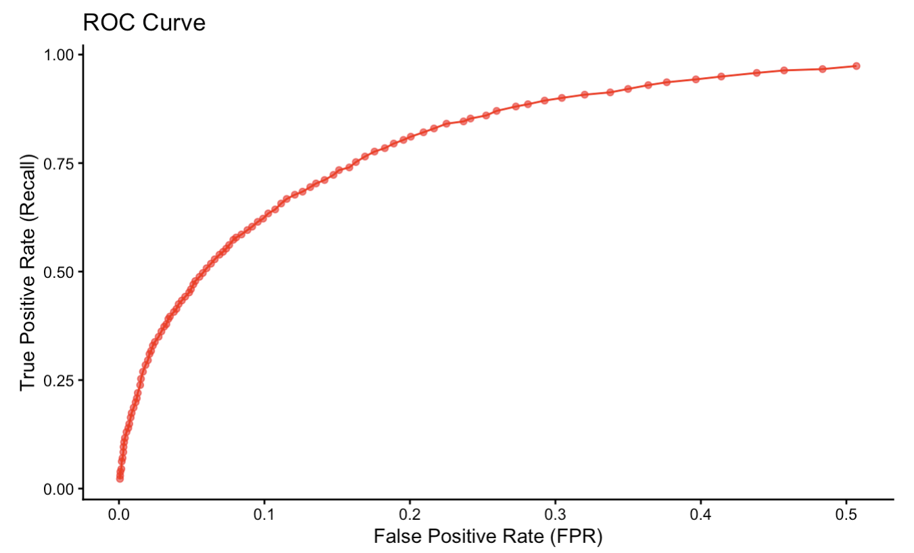
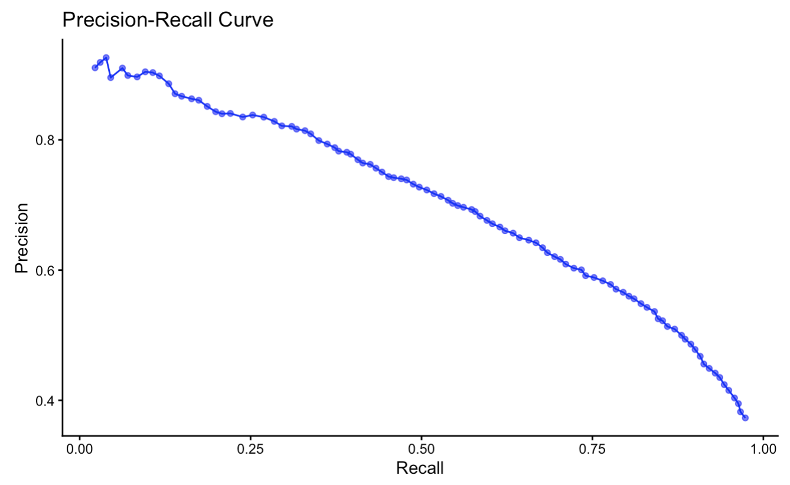

#  m6APrediction

### Predict m6A RNA Methylation Sites Using Random Forest Models

---

##  Overview

`m6APrediction` is an R package designed for the computational prediction of **N6-methyladenosine (m6A)** RNA methylation sites based on sequence-derived and contextual features. It implements a supervised learning workflow in which candidate adenosines are encoded into machine-readable predictors and classified as **m6A-modified** or **unmodified** using a **Random Forest** model.

The package is intended as a compact, teaching-oriented toolkit for epitranscriptomic analysis, enabling users to explore how classical machine learning methods can be applied to post-transcriptional regulation. In particular, it focuses on feature engineering for short sequence windows and on interpreting model outputs (predicted class labels and associated probabilities) in the context of RNA biology.

---
##  Feature
` m6APrediction` provides a streamlined interface for:

-  **Encoding** DNA 5-mer sequences into position-specific categorical predictors suitable for input into tree-based models  
-  **Estimating** m6A modification probabilities using a trained **Random Forest** classifier, returning both discrete calls and posterior probabilities  
-  Performing predictions for both **single** candidate sites and **batches** of sites supplied as a feature table, facilitating integration into larger analysis pipelines  
---
##  Installation

You can install the package directly from GitHub using **devtools** or **remotes**:

```r
# Install devtools if not already installed
install.packages("devtools")

# Install m6APrediction from GitHub
devtools::install_github("tian233-bot/m6APrediction")

# Or alternatively, using remotes
# remotes::install_github("tian233-bot/m6APrediction")
---

##  Example Usage

### 💡 Example 1: Encode DNA 5-mer Sequences
```{r}
library(m6APrediction)

# Example: Encode 5-mer sequences into positional factor features
dna_encoding(c("ATCGA", "GGGTT"))
```

### Example 2: Predict Multiple m6A Sites
```{r}
library(m6APrediction)
library(randomForest)

# Example feature table (minimal viable columns)
feature_df <- data.frame(
  gc_content = c(0.45, 0.62),
  RNA_type   = c("mRNA", "lncRNA"),
  RNA_region = c("CDS", "3'UTR"),
  exon_length = c(1500, 800),
  distance_to_junction = c(120, 50),
  evolutionary_conservation = c(0.8, 0.3),
  DNA_5mer = c("ATCGA", "GGGTT"),
  stringsAsFactors = FALSE
)

# A small toy random forest model for demonstration
set.seed(123)
ml_fit <- randomForest::randomForest(
  x = dna_encoding(feature_df$DNA_5mer),
  y = factor(c("Positive", "Negative"))
)

# Run batch prediction
preds <- prediction_multiple(ml_fit, feature_df)
head(preds)
```

### Example 3: Predict a Single m6A Site
```{r}
# Predict m6A status for one example sequence
prediction_single(
  ml_fit,
  gc_content = 0.55,
  RNA_type = "mRNA",
  RNA_region = "CDS",
  exon_length = 1200,
  distance_to_junction = 80,
  evolutionary_conservation = 0.7,
  DNA_5mer = "ATCGA"
)
```

## Model Performance Visualization

###To showcase the model’s predictive power, include the ROC and PRC curve images from my Practical 4 results.
These figures should be placed under man/figures/ within your package directory.




